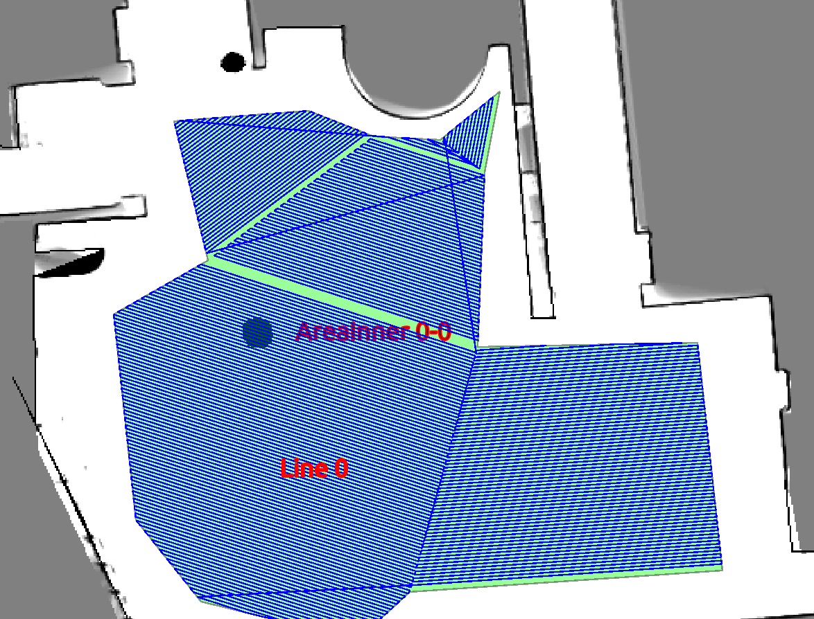
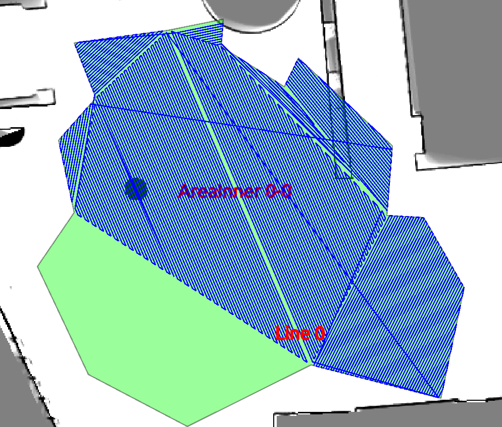
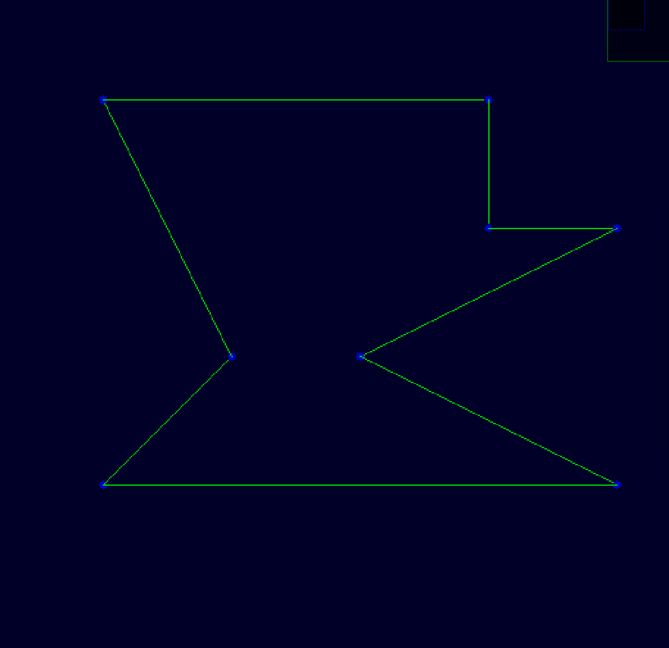
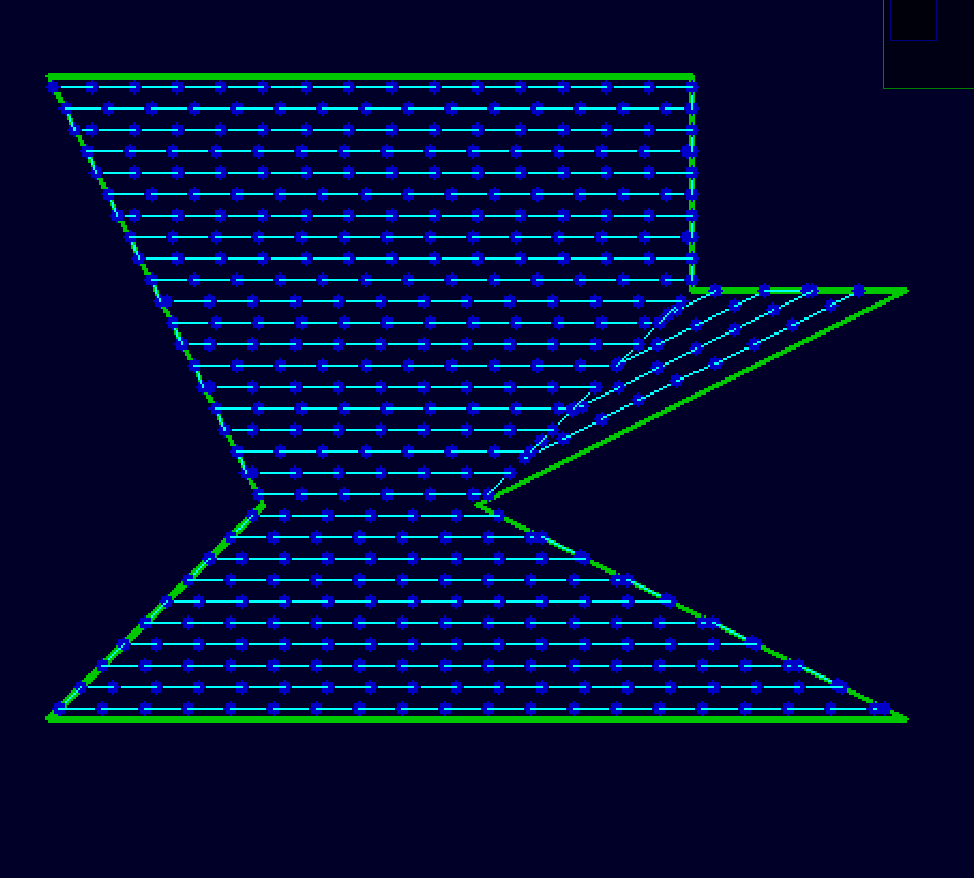

# Coverage Planning

Recommend use CGAL library to finish this coverage planning due the bugs of this repository.

## 0. Overview

<font color=red> **BUG when confronted with complicated polygons**</font> 

Here is the good one



Then we have got a bad one



<font color=blue>**the bug lies in PolygonDecomposition::DecomposeIt() where the processing of erasing polygons and adding polygons** </font>

Decompose the given polygon if concave

Compute a bow-shape complete coverage path for every polygon





## 1. Dependency

- Eigen

- OpenCV


## 2. Reference

The decomposition algorithm is proposed by ZHU chuanmin, TANG jun and XU tiangui 

from College of Mechanical Engineering, Tongji University, Shanghai, China

The paper link : https://wenku.baidu.com/view/a3ccf9abf705cc1755270974.html

The reason I take this algorithm cause I came from Tongji


## 3. Run

```cmake
# build
mkdir build
cd build
cmake ..
make
# run
./planner	
```

